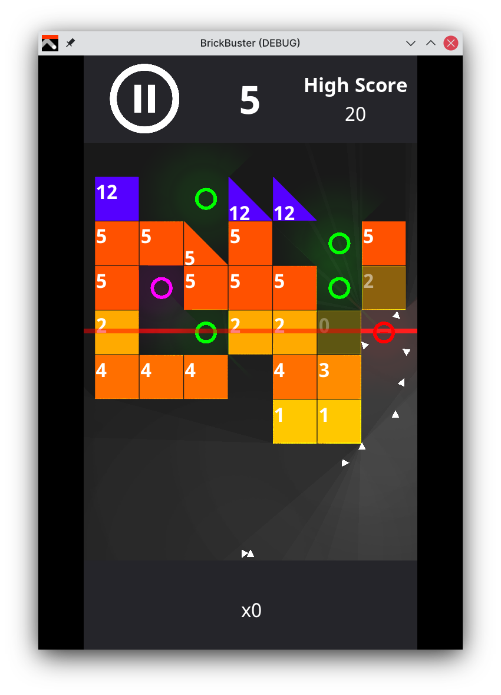

# BrickBuster

BrickBuster is a brick-breaker type game where the objective is to survive as many rounds as possible. Every round new bricks appear... when they reach the bottom of the screen, you lose. You are armed with balls and any special nodes that luck sends your way.

**Version 1.0 is out now!!! [Grab it from the releases page!](https://github.com/claucambra/BrickBuster/releases/tag/1.0)** 😁 Or get it from one of the stores below:

## Features

- Playable on Linux, Windows, macOS, Android, and more thanks to the Godot game engine
- Intuitive controls for both touchscreen and mouse users
- Choose from a handful (2) of game modes!
- Unlock new balls and customise them with different colours
- Make the game your own with brick themes
- View and sort all of your past scores
- Enable kewl and inefficient lighting effects that will probably melt your GPU
- Easy to pick up, hard to master!
- Designed to be extensible -- easily create your own balls and game-modes!
